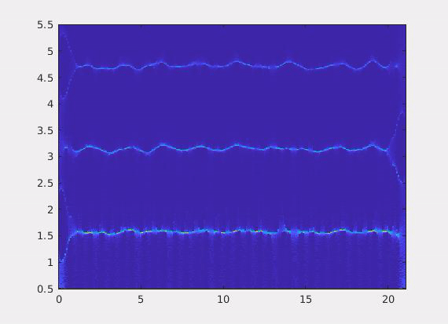
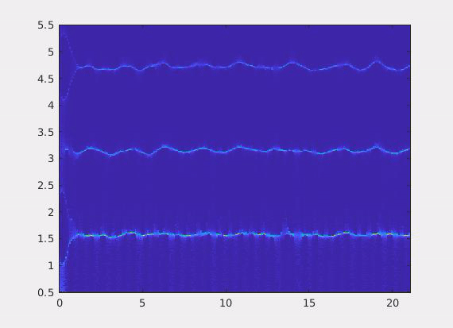

## Overview
This repository contains all the files necessary to perform the algorithm **BoundEffRed** (Boundary Effects Reduction). This is an efficient forecasting approach for the real-time reduction of boundary effects in time-frequency representations. The theoretical background relative to the algorithm can be found in the following paper:  
**[1] A. Meynard and H.-T. Wu, "An Efficient Forecasting Approach to Reduce Boundary Effects in Real-Time Time-Frequency Analysis", *IEEE Transactions on Signal Processing*, vol. 69, pp. 1653&ndash;1663, 2021, [available online](https://hal.archives-ouvertes.fr/hal-03141062).**

<table style="width:100%">
  <tr>
    <th width="50%"></th>
    <th width="50%"></th>
  </tr>
  <tr>
    <th width="50%">Ordinary syncrosqueezing transform of a cardiac signal</th>
    <th width="50%">Boundary-free syncrosqueezing transform of the same signal, obtained via BoundEffRed</th>
  </tr>
 </table>

***WARNING:*** This algorithm has been designed to work optimally with MATLAB R2020a. We do not guarantee its compatibility with previous releases.

## Contents

The folder `Signals` contains some biomedical and synthetic signals used to implement the above-mentioned algorithm. The following folders are specifically related to the implementation of BoundEffRed:

* `Algorithm` contains the MATLAB functions enabling the implementation of BoundEffRed, using differents extensions schemes such as SigExt, EDMD, or GPR (see the paper for details).
* `TimeFrequencyScaleRep` contains the functions generating Time-Frequency and Time-Scale representations such as STFT, Synchrosqueezing Transform, Reassignment, or ConceFT.
* `Scripts` contains the scripts to perform the experiments detailed in the paper. Some corresponding results are directly provided in subfolder `Results`.

The folder `Paper` contains the article and the associated Supplementary Materials, while the folder `Animations` contains some videos featuring the real-time boundary-free synchrosqueezing transforms of a few biomedical signals, provided by BoundEffRed.

# Authors

Authors: Adrien Meynard and Hau-Tieng Wu  
Contact email: adrien.meynard@duke.edu
